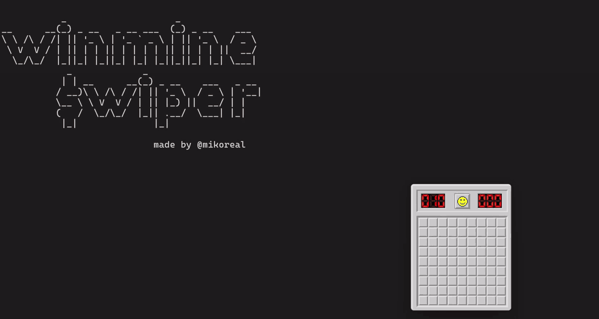

# Reverse Engineering writeup

All knowledge used to create the cheating tool was gained through RE process and written up below.

**[Hacking Minesweeper - static and dynamic analysis of `winmine.exe`](hacking-minesweeper-writeup/hacking-minesweeper-writeup.md)**

The full reverse-engineering process in 19 pages, from `rand` in the import table to `onRightClickField` at offset `0x374F`.

Also available as [LaTeX source](hacking-minesweeper-writeup/hacking-minesweeper-writeup.tex), and as the
original thesis excerpt in PDF ([English](hacking-minesweeper-writeup/ref3_en.pdf) · [Polish](hacking-minesweeper-writeup/ref3_pl.pdf)).

# winmine_swiper

External cheat for Windows XP Minesweeper (`winmine.exe`), written in C++23.

Built as part of my **Bachelor of Science in Computer Science thesis**.

The point of the project was to learn reverse engineering of x86 binaries.
The board was located in the game's memory through static and dynamic analysis of the binary, every byte of
that board was decoded, and the game's own right-click handler was found so that it could be
called remotely.

The tool is what that knowledge is worth once you write it down.



## What it does

Start the game, then run the tool. It polls for hotkeys:

| Key | Action |
|-----|--------|
| **F2** | Print the full board to the console - including the mines the player cannot see |
| **F3** | Place a flag on every mine automatically |
| **End** | Exit |

```
Minefield map  ('*' mine, '#' detonated, 'F' flag, '?' question mark, '.' covered, digit = adjacent mines):
    123456789
  1 ..*......
  2 ...*.....
  3 ........*
  4 ...*.....
  5 .*.......
  6 *.....*..
  7 ...*.....
  8 .......*.
  9 *........
```

(F2 pressed on a fresh Beginner board: all 10 mines visible, nothing revealed yet.)

## How it works

**Reading the board**

The minefield is a flat byte array at `imageBase + 0x5340`, one byte per
cell, with a fixed row stride of 32 bytes regardless of difficulty:

```
cell address = imageBase + 0x5340 + 32 * row + column      (row and column are 1-indexed)
```

Board dimensions live at `+0x5334` (width) and `+0x5338` (height). Each cell byte packs a
physical property in the high bits and a visual state in the low 5 - `0x80` means a mine is
hidden there, `0x40` means the player has revealed it. The tool reads the array row by row with
`ReadProcessMemory` and decodes it against the cell-state table derived in
[§3 of the writeup](hacking-minesweeper-writeup/hacking-minesweeper-writeup.md#3-reconstructing-the-minefield-map).

**Flagging the mines**

Rather than writing cell bytes directly (which would desync the game's
own mine counter and leave the cell unrepainted) the tool calls the game's own right-click
handler, `onRightClickField(int row, int column)` at offset `0x374F`. It allocates a page in the
target process with `VirtualAllocEx`, writes an 18-byte shellcode stub that pushes the two
arguments and calls the function, then fires it with `CreateRemoteThread`, once per mine.

Every offset and constant above is derived step by step in
[the writeup](hacking-minesweeper-writeup/hacking-minesweeper-writeup.md); §6 maps each finding
to the line of `common.h` it became.

## Source layout

```
external/
  common.h            - offsets and cell constants  (every value derived in the writeup)
  process_memory.hpp  - Process RAII wrapper, ReadProcessMemory helpers
  game.h / game.cpp   - Board, MineSwiper (board reading, shellcode injection)
  mineswiper.cpp      - entry point, hotkey loop
hacking-minesweeper-writeup/
  hacking-minesweeper-writeup.md   - the writeup
  hacking-minesweeper-writeup.tex  - same, LaTeX source
  img/                             - figures
```

The C++23 standard is utilized where it earns its place
- a multidimensional `operator[]` with deducing `this` for the board
- `views::cartesian_product` + `ranges::to` for the mine scan,
- `views::enumerate` + `views::chunk` for rendering
- `std::expected` for memory-read and remote-call failures.

## Build

Visual Studio 2022, Win32 (x86 - the target is a 32-bit process), `/std:c++latest`.

Open `winmine_swiper.sln` and build the `external` project.

Needs a compiler with C++23 library support (`<print>`, `<expected>`, `<ranges>`) - MSVC 19.39
or newer.

`winmine.exe` must already be running when you press a hotkey.

## Notes

The addresses here are specific to the Windows XP build of `winmine.exe`, which Microsoft
stopped shipping with Windows Vista.

The binary itself is not distributed in this repository.

The target is a single-player offline game from 2001 with no anti-cheat, no online component
and no leaderboard - it was chosen because it is small enough to understand completely.
