# Hacking Minesweeper

**Static and dynamic analysis of `winmine.exe` (Windows XP Minesweeper)**

*by [@mikoreal](https://github.com/mikoreal)*

---

This is the research chapter of my bachelor's thesis, rewritten as a standalone writeup and
translated from Polish. It documents how the Minesweeper board was located in the game's
memory, how the meaning of every byte of that board was decoded, and how the game's own
"place a flag" function was found so that it could later be called remotely.

The tool built on top of these findings lives in this repository - see
[`README.md`](../README.md). Section 6 maps each finding to the constant it became in
[`external/common.h`](../external/common.h).

**Target:**

`winmine.exe`, Windows XP build, 32-bit PE, no packing or obfuscation.

**Tools:**

IDA Free (disassembler, decompiler, debugger, IDC scripting) and CrySearch (memory scanner).

**Contents**

1. [Static analysis](#1-static-analysis)
2. [Dynamic analysis](#2-dynamic-analysis)
3. [Reconstructing the minefield map](#3-reconstructing-the-minefield-map)
4. [Locating the flag-placement function](#4-locating-the-flag-placement-function)
5. [Summary of findings](#5-summary-of-findings)
6. [From findings to code](#6-from-findings-to-code)

---

## 1. Static analysis

The analysis began by loading the game's executable into IDA Free. The file format was
correctly recognised as *Portable Executable for 80386*, which in plain terms means a
standard 32-bit Windows application. The default loading options were accepted.

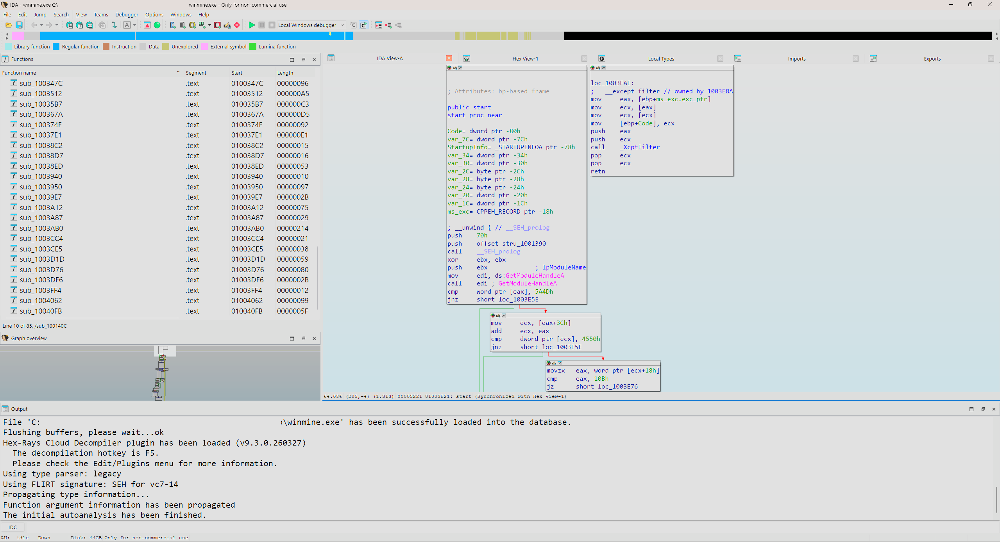
*Figure 1: IDA Free, initial view after loading `winmine.exe`.*

Our initial goal was to find the place in memory where the game stores information about the
minefield. To get there, it is worth running a thought experiment first: how would we
implement the board if we were the programmer of Minesweeper?

Recreating the game - for an example board of 9 × 9 - requires storing, for each cell,
properties such as:

- coordinates (row and column index),
- interaction state (unrevealed, revealed, flagged),
- logical content (empty, digit, mine).

To simplify the architecture, the last two can be collapsed into a single attribute
representing the combined variants of state and content (e.g. "unrevealed-mine" or
"revealed-digit"). For requirements specified that way, a natural implementation emerges: a
two-dimensional array of integers. The array indices map directly onto cell coordinates, and
the numeric value stored in each element defines the state of that cell. Such a data type is
entirely sufficient for the game logic to work.

Formulating that hypothesis does not, however, solve the problem of locating the code that
reads and modifies the board inside the binary. We can be confident such code exists - most
likely functions accessing the minefield. They must run both before each new game (to clear
the board and generate fresh mine positions) and during it, as the player's moves change the
state of individual cells.

Continuing from a software-engineering perspective: placing mines on the board is
unquestionably based on drawing cell indices at random. Since the game mechanics do not
require cryptographically secure randomness, the authors of Minesweeper most likely used a
standard pseudo-random number generator - the one built into the development environment's
runtime, i.e. the C standard library.

Information about the external functions a PE imports at startup is recorded in its Import
Address Table (IAT). In IDA Free this is available under `View > Open subviews > Imports`.

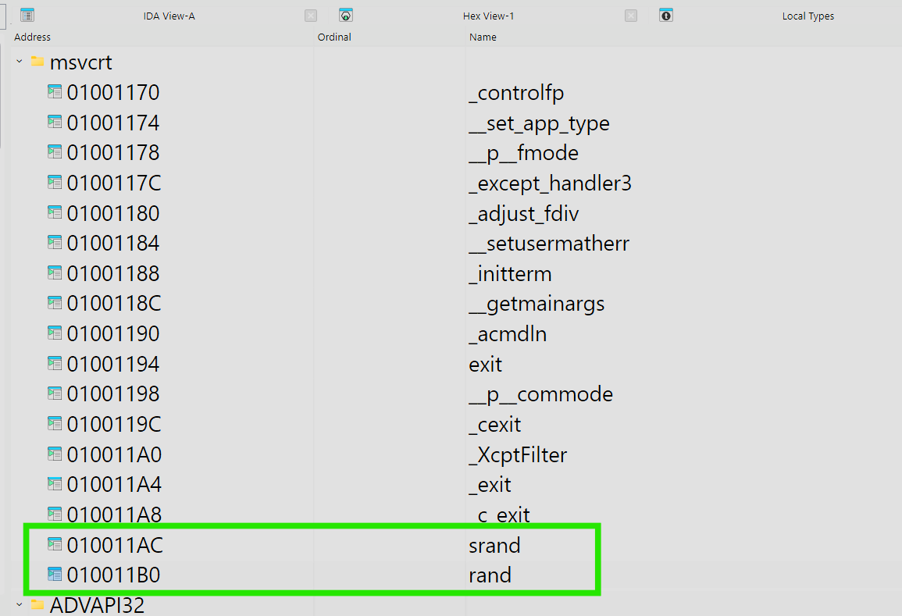
*Figure 2: the Import Address Table of `winmine.exe`. `srand` and `rand` are imported from `msvcrt.dll`.*

The IAT does indeed reveal the import of two well-known pseudo-random number functions:
`srand` and `rand`. They come from `msvcrt.dll` (the Microsoft C Runtime Library), which
provides the C standard library implementation on Windows. `srand` initialises the
generator's seed; `rand` returns the computed pseudo-random values.

Importing these functions is not by itself conclusive proof that they are used by the mine
placement algorithm. To verify the hypothesis we need to trace control flow and identify
every place in the code that references the `rand` symbol. In IDA this was done by navigating
to the import address `0x010011B0` in the Imports view and using the built-in cross-reference
search (XREFs), which lists every address in the file that calls or otherwise references the
symbol of interest.

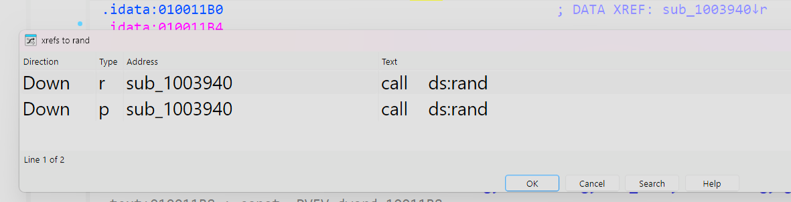
*Figure 3: cross-references (XREFs) to the `rand` symbol - only two, both inside `sub_1003940`.*

In the entire executable there are only **two** references to `rand`. Both are direct calls,
and both are located inside a single function which IDA - the original symbols having been
stripped at compile time - automatically named `sub_1003940`. This significantly narrows the
search: all machine code associated with generating pseudo-random numbers sits in one block.
It also keeps the cost low if the hypothesis has to be rejected. `sub_1003940` was therefore
inspected in detail.

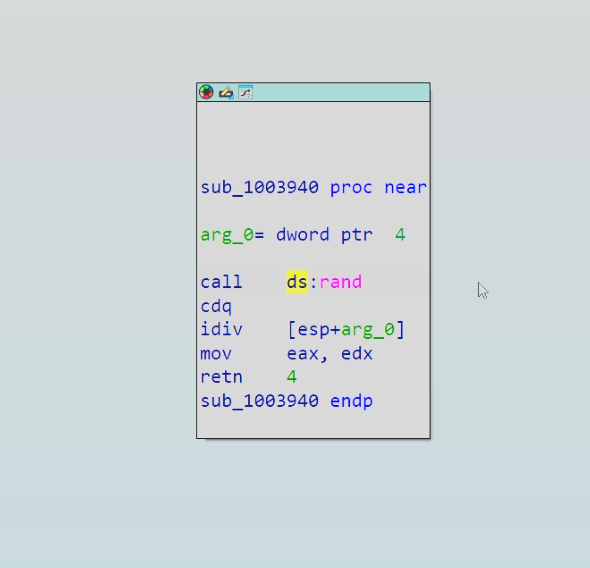
*Figure 4: the disassembly of `sub_1003940`.*

Using the decompiler bundled with IDA Free we can obtain pseudocode close to C, which is
easier to analyse.

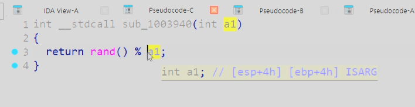
*Figure 5: the C pseudocode of `sub_1003940` produced by the IDA decompiler.*

The decompiler's interpretation confirms the conclusions drawn from the machine code.
`sub_1003940` takes one `int` parameter, temporarily named `a1`, and returns an `int`. It
calls `rand()`, then returns the remainder of dividing that value by `a1`. In short:
`sub_1003940` returns a pseudo-random number greater than or equal to zero and smaller than
`a1`.

We document this finding using *Rename global item…* (the **N** key) and *Edit func comment*
(the **/** key), naming the function `rand_0` and annotating it with a short comment.

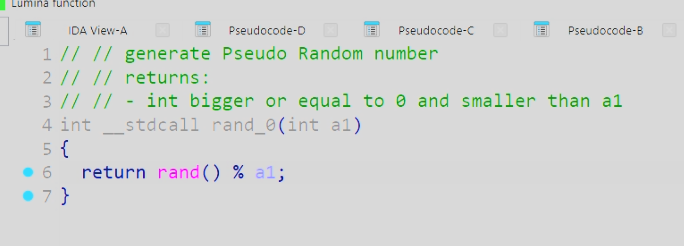
*Figure 6: `rand_0`, renamed and commented in the IDA project file.*

Documenting findings this way propagates the change across the whole IDA database. From now
on every occurrence of the function uses the name `rand_0` instead of `sub_1003940` and
displays the first line of our comment, which improves readability and reduces information
overload. `rand_0` is, in effect, a wrapper around `rand()` from the C standard library.

Just as we previously used *List all cross references to…* to find calls to `rand()` and
thereby documented `rand_0(int a1)`, we now do the same for calls to `rand_0` itself.

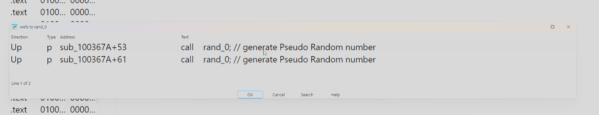
*Figure 7: cross-references to `rand_0` - again only two, both inside `sub_100367A`.*

The value of documenting the analysed machine code is immediately visible: the xrefs window
now shows our own function name and comment. Fortunately for us, and just as before, there
are only two references, and again they sit inside a single function - this time
`sub_100367A`.

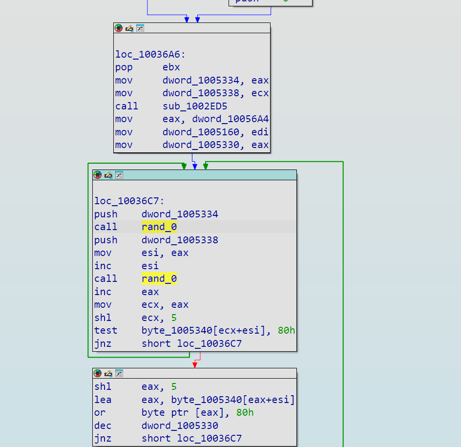
*Figure 8: the disassembly of `sub_100367A`.*

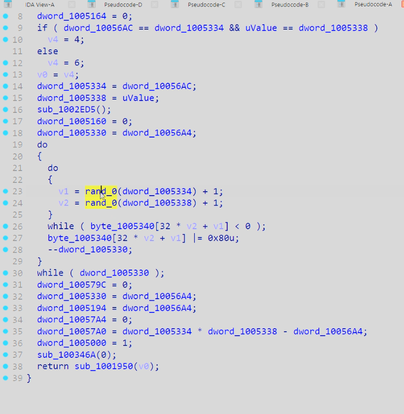
*Figure 9: the C pseudocode of `sub_100367A` produced by the IDA decompiler.*

This gives us the next hypothesis: the local variables `v1` and `v2` hold the row and column
indices of board cells containing mines. If we confirm it, that would mean `dword_1005334`
and `dword_1005338` determine the number of rows and columns. To make further progress we
test the hypothesis with dynamic analysis.

---

## 2. Dynamic analysis

Dynamic analysis differs from static analysis in that the software under study is executed on
the researcher's machine and examined as it runs. It is indispensable for programs that are
packed, obfuscated, or otherwise built to hide their true behaviour.

We begin this segment by looking at `v1` and `v2` - specifically at the values assigned to
them when our documented `rand_0(int a1)` is called during execution. We will also examine
`dword_1005334` and `dword_1005338`, which bound the range of the drawn numbers.

The goal is to halt execution at the instructions of interest and inspect the values assigned
to `v1`, `v2`, `dword_1005334` and `dword_1005338`. We start with the latter two.

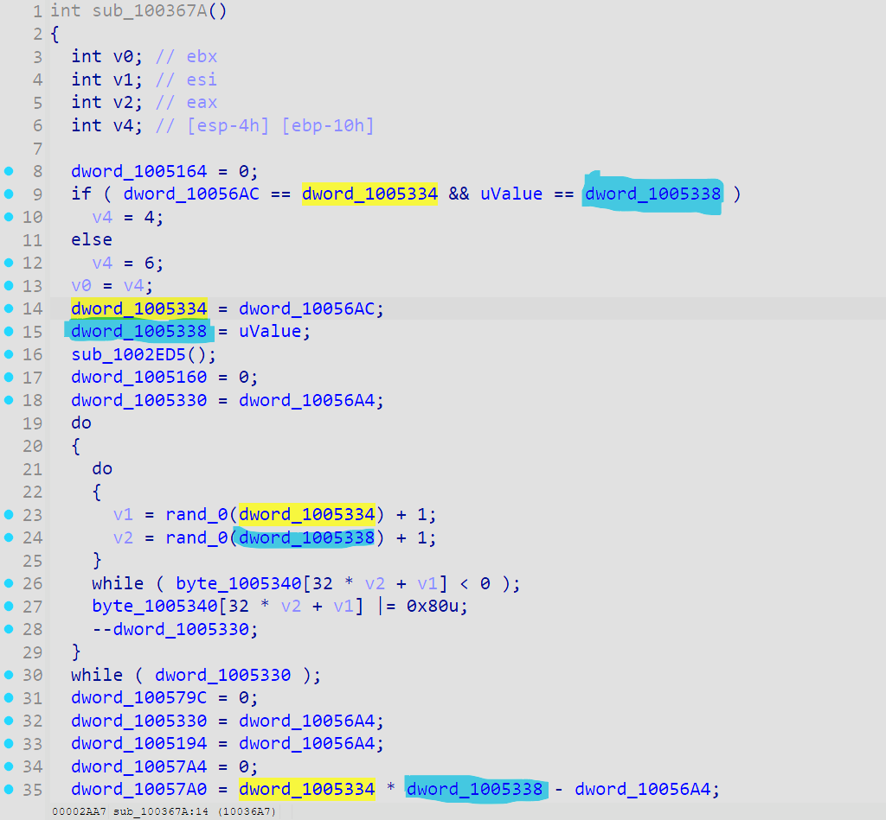
*Figure 10: the C pseudocode of `sub_100367A` with the `dword_…` variables highlighted.*

As seen in lines 23 and 24 of the decompiled pseudocode, both are passed as arguments to
`rand_0`. In line 23 `v1` is assigned `rand_0(dword_1005334) + 1`. The expression `rand_0(x)`
returns a pseudo-random number from the range ⟨0, x), and because of the trailing `+ 1` the
whole expression returns a number from ⟨1, x+1). Since we know the result is an integer, the
range simplifies to ⟨1, x⟩. Translating this to our specific calls: `v1` holds an integer
from ⟨1, `dword_1005334`⟩, and `v2`, analogously, from ⟨1, `dword_1005338`⟩.

The `dword_…` variables also appear in a few places other than lines 23–24 inside
`sub_100367A`. In line 9 they are compared, and in lines 14–15 they are assigned the values
the program then uses to constrain `v1` and `v2` as described above.

We therefore switch back from the pseudocode to the disassembly view, in order to halt
execution at a specific machine-code instruction - we are interested in lines 14–15 of the
pseudocode, that is, the assignments to the `dword_…` variables. Right-clicking line 15 and
choosing `Synchronize With > IDA View-A, Hex View-1` highlights the corresponding instruction
in green once we switch to the disassembly view.

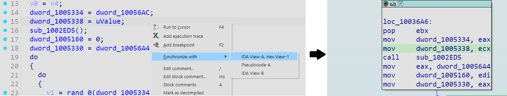
*Figure 11: synchronising the IDA pseudocode and disassembly views.*

Next, to halt execution at the `mov dword_…, eax/ecx` instructions, we right-click each line
and choose *Add Breakpoint*.

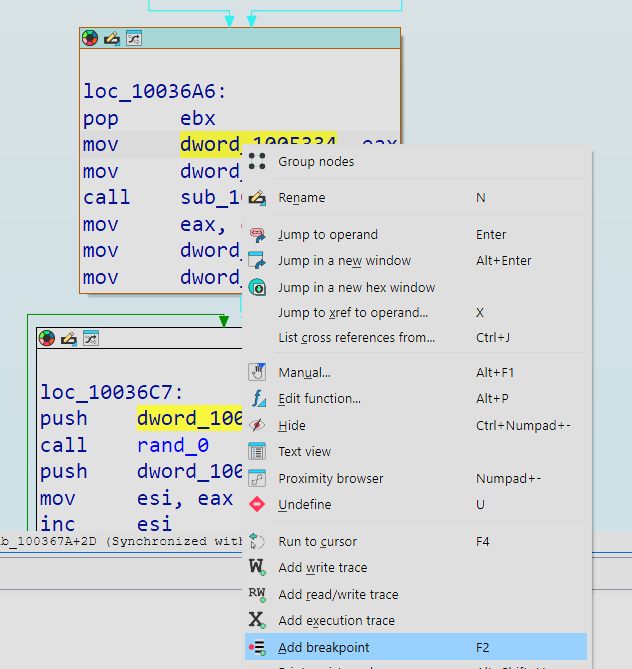
*Figure 12: adding a breakpoint on the instruction of interest.*

To automate the process we attach, via *Edit Breakpoint*, a script in IDC - IDA's native
scripting language - which prints a short message to the Output window each time the
instruction executes, reporting the relevant register: `eax` for `dword_1005334` and `ecx`
for `dword_1005338`.

We then run the program under IDA's built-in debugger. The game starts and our script reports
that both variables were assigned the value **9**. Note that 9 × 9 is exactly the board size
of Minesweeper's *Beginner* level. Without closing the program, we switch the difficulty to
*Intermediate*, where the board has 16 rows and 16 columns - and those are exactly the values
our script reports.

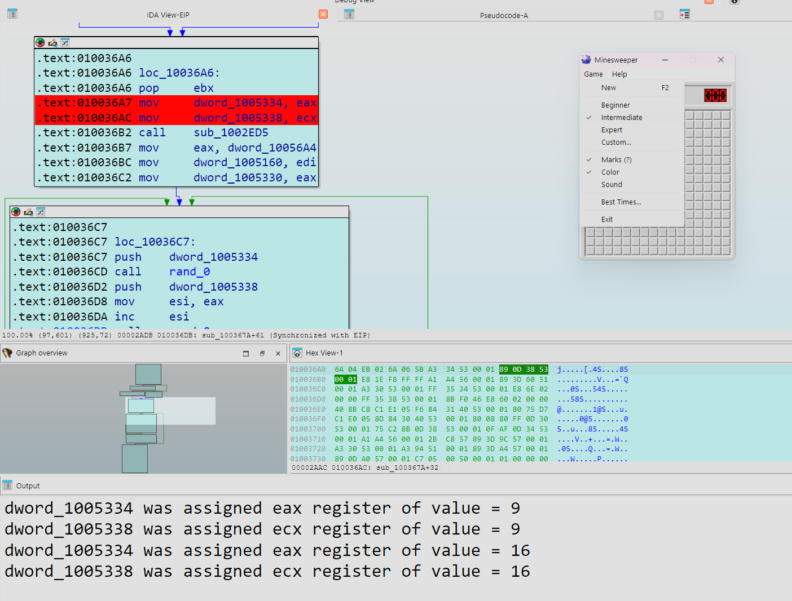
*Figure 13: the IDC breakpoint script reporting 9 × 9 for Beginner, then 16 × 16 for Intermediate.*

So the two `dword_…` variables store the dimensions of the board. One question remains: which
of them is the width and which is the height? A square board cannot answer that, so we select
*Custom* mode in the game and deliberately choose asymmetric values - height 9, width 15.

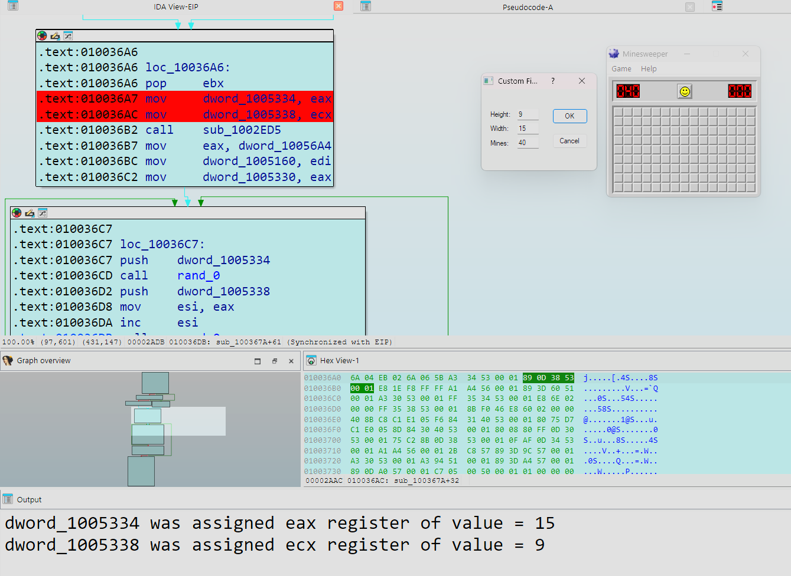
*Figure 14: a custom board of height 9 and width 15 - `dword_1005334` reports 15, `dword_1005338` reports 9.*

This proves that `dword_1005334` holds the **width** (number of columns) and `dword_1005338`
the **height** (number of rows). We rename them to `width` and `height` in the database.

Since these variables bound the drawn numbers, `v1` and `v2` take values from ⟨1, `width`⟩
and ⟨1, `height`⟩ respectively. And since this is the only place in the program where any
numbers are drawn at random - additionally drawn with the range constrained to the board's
dimensions - we have proven that `v1` and `v2` hold indices of random cells on the board.

That leads to the next hypothesis: during a single breakpoint hit, `v1` and `v2` hold the
position indices of one of the mines. We verify it exactly as we verified the `dword_…`
variables, with a breakpoint script that prints the assigned values.

---

## 3. Reconstructing the minefield map

The game was restored to *Beginner* mode, where 10 mines are placed on a 9 × 9 board. With
breakpoints and scripts set on `v1` and `v2`, we obtain - consistent with the earlier
findings - values between 1 and 9 inclusive.

One question remains: how are the row and column indices counted? They could be counted in
several ways. Taking advantage of being in the middle of dynamic analysis, we play a round
that we deliberately lose, because after a lost game Minesweeper reveals the location of every
mine, letting us see how rows and columns are indexed. We then map the drawn indices onto the
corresponding mines on the board.

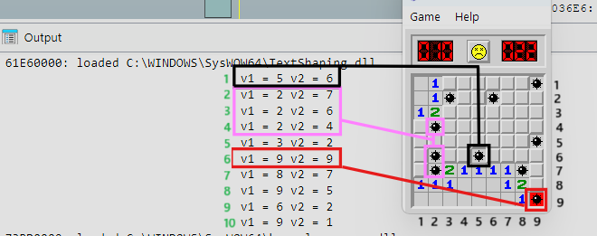
*Figure 15: the captured register values (board indices) mapped onto the revealed minefield.*

After a short manual assignment we have our answer: **row indices are counted from 1, top to
bottom; column indices are counted from 1, left to right.**

Moreover, `v1` and `v2` were assigned 10 times during a single game - exactly the number of
mines in *Beginner* mode. For documentation, `v1` and `v2` were therefore renamed to
`mineColumnIdx` and `mineRowIdx` respectively.

Having proven that `mineColumnIdx` and `mineRowIdx` define the location of the mines, analysis
of the pseudocode reveals the key operation of the program.

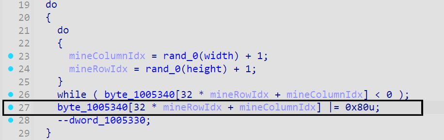
*Figure 16: the C pseudocode of the mine-placement loop, with line 27 marked.*

Line 27 contains the instruction:

```c
byte_1005340[32 * mineRowIdx + mineColumnIdx] |= 0x80u;
```

The expression `32 * row + column` is a way of mapping a two-dimensional array onto a
one-dimensional block of RAM. **The width of a row in memory is always 32 bytes, regardless of
the difficulty level.**

Lines 26–27 are the last lines of the function that refer to `mineRowIdx` and `mineColumnIdx`.
In both cases they are used to index the array `byte_1005340`. Line 26 is the loop condition
that redraws indices, and line 27 modifies the value of `byte_1005340` at the index computed
from the previously drawn values. With high confidence we can say that `byte_1005340` is the
array we are after, storing information about each cell of the minefield. Moreover, since it
is an array of bytes, we can put forward the thesis that one byte is devoted to each cell.

We also learned how cells with mines are marked in the game's memory. The expression
`|= 0x80u` - assigning the result of a bitwise OR with `0x80` - sets the highest bit of the
byte, which means that a value of `0x80` or higher at a given address signals the presence of
a mine in that cell.

The memory into which the mines are written is represented in IDA by the static database
address `byte_1005340`. Being certain of this address, we can move from the disassembler
directly to a memory scanner.

To verify the structure of the board in real time, CrySearch was used. Because Windows XP -
the system the examined application originates from - loads `.exe` files at the default base
address `0x01000000`, the address `0x01005340` seen in IDA translates to a relative **offset of
`0x5340`** from the start of the game's module in the process.

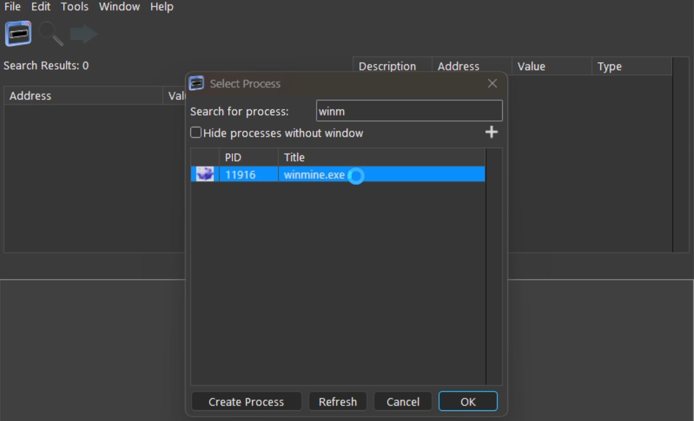
*Figure 17: attaching the CrySearch memory scanner to the `winmine.exe` process.*

Next, using the knowledge from the previous section, the offset of the first cell of the board
was computed by substituting 1 for both indices:

```
32 · (mineRowIdx = 1) + (mineColumnIdx = 1) = 33 = 0x21
```

The minefield array begins at `0x1005340`. From pointer arithmetic it follows that adding the
computed offset to this address yields the address of the first cell. On this basis a general
formula was derived for the address of any cell (row, column):

```
address = 0x1005340 + (32 · row + column)
```

For the cell with indices (1, 1) the formula gives `0x1005361`. That address was added to
CrySearch using *Manually add address*, with the data type set to *Array of bytes* of length 9
- the number of cells in a row at the *Beginner* level.

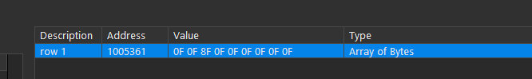
*Figure 18: the first row of the board added to the CrySearch table - `0F 0F 8F 0F 0F 0F 0F 0F 0F`.*

As the figure above shows, for this particular instance of the game the third cell contains a
mine: the byte corresponding to it is greater than or equal to `0x80`, which we established
signals a mine.

The extracted board buffer (the first row) was then put under continuous observation. In the
game window a series of controlled interactions was carried out:

- placing a flag on an unrevealed cell,
- revealing an empty cell,
- revealing a cell adjacent to mines (containing a digit).

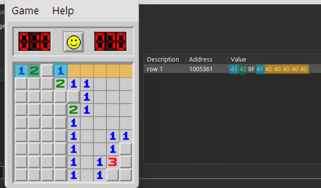
*Figure 19: observing the bytes of the first row of the minefield in memory during play.*

By recording and comparing the values of individual bytes before an action and immediately
after it, an unambiguous mapping of the game's visual states onto their numeric representation
in RAM was identified. A cell takes the value `0x0F` by default (unrevealed); placing a flag
overwrites that byte with `0x0E`. A cell containing a mine reads `0x8F`. Revealed cells take
values corresponding to the number of adjacent mines - e.g. `0x41` for a one, `0x42` for a two.

This method of analysis - observing the changes in memory caused by the player's actions -
made it possible to build a table of all possible states of a board cell. Understanding these
values is a necessary condition for the deliberate memory manipulation performed by the tool.

Two key bit flags were identified, describing the physical properties of a cell:

**Table 1: key bit flags determining the properties of a cell**

| Value  | Meaning in the game logic       |
|--------|---------------------------------|
| `0x40` | The cell has been revealed by the player |
| `0x80` | A mine is hidden under the cell |

The lower 5 bits describe the visual state of the cell:

**Table 2: all possible states of a minefield cell byte**

| Value         | Meaning in the game logic          | Additional explanation |
|---------------|------------------------------------|------------------------|
| `0x00`        | Empty cell (safe)                  | no mines in the neighbourhood |
| `0x01`–`0x08` | Cell with a digit (safe)           | the digit indicates the number of mines adjacent to the cell |
| `0x0A`        | Cell with a mine (loss)            | a mine neither revealed nor flagged by the player; revealed at the end of a lost game |
| `0x0B`        | Incorrectly flagged cell (safe)    | erroneously flagged as containing a mine |
| `0x0C`        | Cell with a mine (loss)            | erroneous revealing of a cell containing a mine, resulting in detonation; occurs only on the cell whose revealing ended the game |
| `0x0D`        | Cell with a question mark          | marked by the player as uncertain with the right mouse button |
| `0x0E`        | Cell with a flag                   | marked by the player as containing a mine with the right mouse button; correctly flagging every armed cell (and revealing all safe cells) results in a win |
| `0x0F`        | Unrevealed cell                    | default state |
| `0x10`        | Board margin                       | invisible frame bounding the board |

The values from these two tables do not occur in memory in isolation. **The final byte of a
cell is the result of superimposing - through a logical OR - the physical property and the
visual state.** This means the values read by the memory scanner are precise logical sums:

```
revealed empty cell:  (0x00) OR (0x40) = 0x40
revealed digit 1:     (0x01) OR (0x40) = 0x41
unrevealed mine:      (0x0F) OR (0x80) = 0x8F
flagged mine:         (0x0E) OR (0x80) = 0x8E
```

The screenshot below confirms the theory across the whole board:

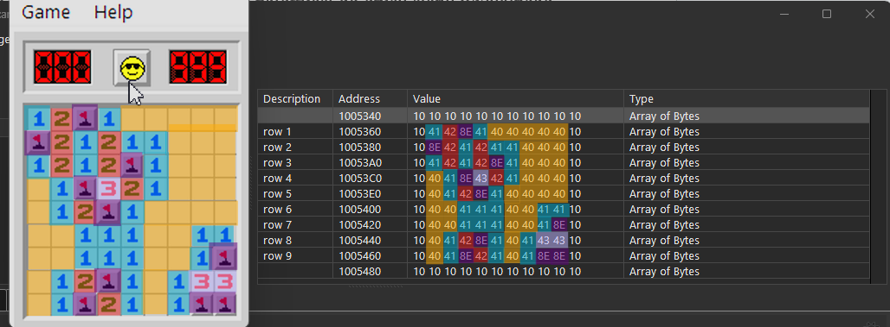
*Figure 20: the full mapping of the minefield bytes to the memory of the game process. Note the `0x10` border bytes framing every row.*

A lost game confirms the remaining, rarer states of the table:

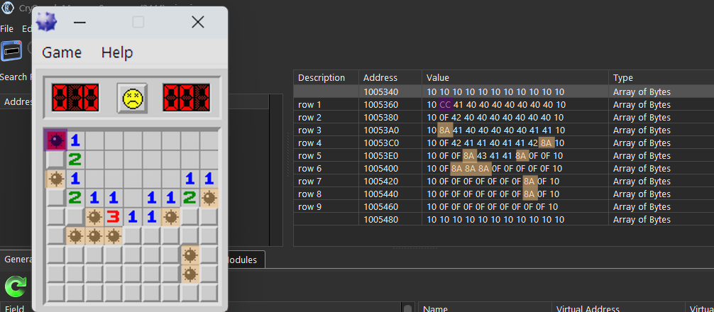
*Figure 21: memory after a lost game. `0xCC` = `0x0C | 0x40 | 0x80` is the detonated mine that ended the game; `0x8A` = `0x0A | 0x80` marks the other mines, revealed on loss.*

At this point enough information has been gathered to implement the first feature of the tool
- previewing the minefield map. Such a map allows every game of Minesweeper to be won in
considerably less time than would otherwise be possible. In the next section, going one step
further, we gather the knowledge needed to implement automatic flag placement on every cell
that contains a mine.

---

## 4. Locating the flag-placement function

The previous section answered the questions about the layout of the minefield in the game's
memory. Focusing now on the second planned feature - automatic mine flagging - we examine the
game's own internal function that places a flag on a given cell, so that our tool can call it
remotely. When that function is invoked for each mine on the board, the effort required from
the player to win a round is reduced to merely revealing the safe cells.

Reusing an existing in-game function, rather than writing the cell byte directly, both
minimises the work and avoids interfering with the game's stability: the game updates its own
internal counters and repaints the cell exactly as it would for a real click.

For this purpose we returned to CrySearch and the previously created `winmine_crysearch.csat`
file. Because the previous section reconstructed the minefield map from the game's memory, we
have the rows laid out in CrySearch as slices of 11 bytes - each row of the initial 9 × 9
board, plus the invisible border byte on either side.

In section 2, while examining `rand_0`, we wanted to determine what values are passed as
arguments during its calls. We attached IDA's debugger to the game process and set breakpoints
on specific machine-code instructions, and established that they were the board dimensions.
Now we want something similar, but approached from the other side: the address of the
instruction that *overwrites* the values of the minefield cells.

To find it, we set a breakpoint on the memory address of a single cell. The cell with indices
(1, 1) was chosen - the one visible in the upper-left corner of the board - for which the
formula gives the address `0x1005361`. Using CrySearch, a debugger was attached to the
`winmine.exe` process. In the memory view the address of interest was added, and a breakpoint
of type *Write* was set on it via `Set Breakpoint -> Write`. We then returned to the game and
right-clicked the cell in the upper-left corner of the board.

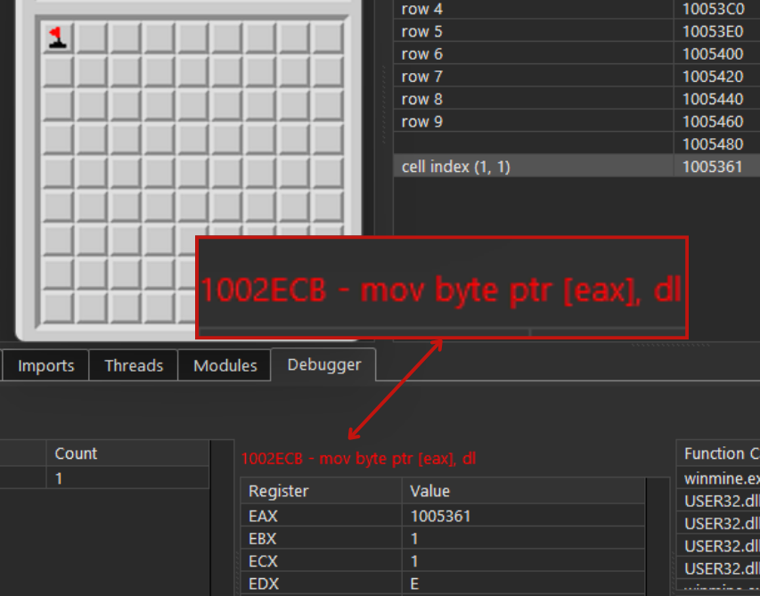
*Figure 22: the write breakpoint on cell (1, 1) triggered by the instruction at `1002ECB`.*

After flagging the cell, the breakpoint on the address storing that cell's state byte was
activated by the instruction at address `1002ECB` - `mov byte ptr [eax], dl`. The captured
registers are already informative: `EAX = 1005361` (the address of cell (1, 1)), `EBX = 1`,
`ECX = 1` (its indices) and `EDX = E` - the flag state from Table 2.

For readability we returned to the IDA project file and, in the disassembly view, jumped to the
address of interest using the *Jump to address* dialog (shortcut **G**), entering `1002ECB`.

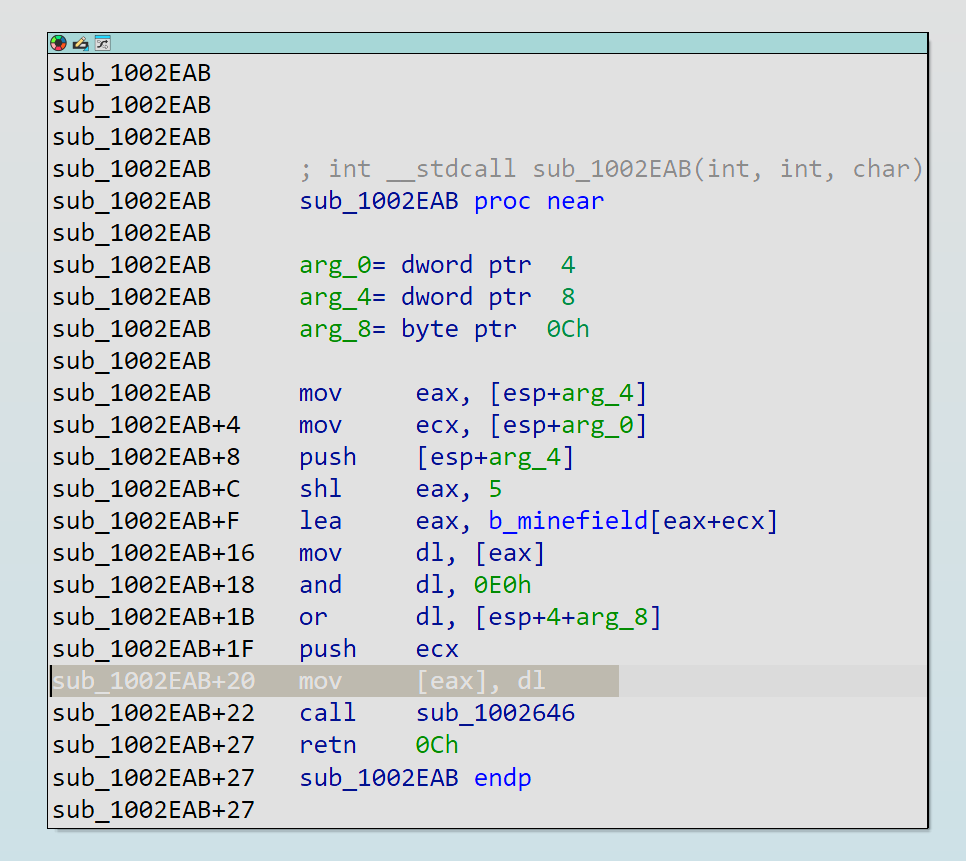
*Figure 23: the disassembly of `sub_1002EAB`, the function containing the write at `1002ECB`.*

The instruction `0x1002ECB` that triggered the breakpoint turns out to be part of a function
beginning at `0x1002EAB`. This function seems an ideal candidate for a remote call to change
the logical and graphical state of a specific cell.

While gathering the information needed for the remote call we examine the function's signature
- and run into a problem. `sub_1002EAB` takes three arguments. Two are integers, which given
the context (the function is called for a specific cell) most likely means they are the row and
column indices. The last one, however, is of type `char`. The `char` type is one byte wide,
exactly the size of a single element of the minefield array. We can therefore suppose it
determines the new state of the cell, or a bitmask to be combined with the current state.

The body of the function settles it:

```asm
shl  eax, 5                      ; row * 32
lea  eax, b_minefield[eax+ecx]   ; &minefield[32*row + col]
mov  dl, [eax]                   ; current cell byte
and  dl, 0E0h                    ; keep the high 3 bits (physical properties)
or   dl, [esp+4+arg_8]           ; OR in the third argument
mov  [eax], dl                   ; write back
```

The function preserves the cell's physical property bits and replaces the low bits with the
third argument. That is precisely the `physical OR visual` composition established in
section 3 - so the `char` argument is the new **visual state**.

Before capturing its value at runtime, let us look at every reference to `0x1002EAB` in the
program, using the cross-references view (shortcut **X**).

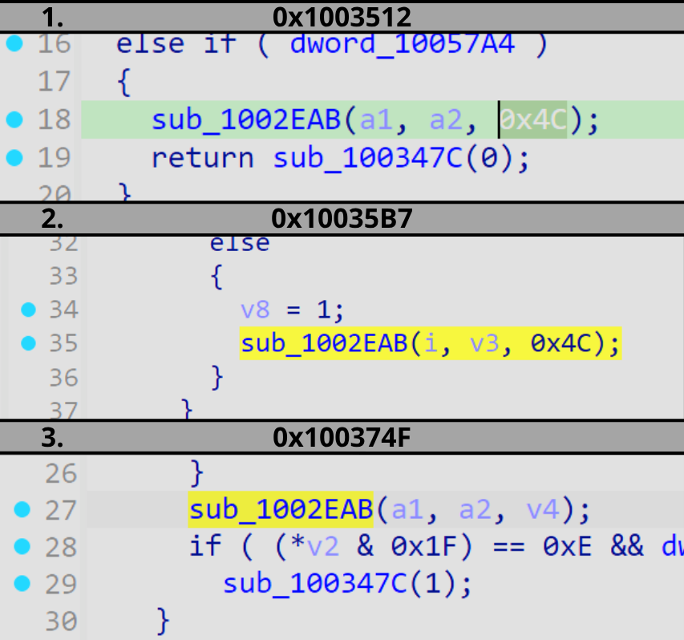
*Figure 24: the three call sites of `sub_1002EAB`.*

The xrefs window points to three different places in the machine code where the analysed
subprogram is called - inside procedures at the addresses:

1. `0x1003512`
2. `0x10035B7`
3. `0x100374F`

For readability we refer to these procedures by the numbers above, or by their offset relative
to the file's `ImageBase`.

An interesting relationship is visible. Functions 1 (offset `0x3512`) and 2 (offset `0x35B7`)
call `sub_1002EAB` always passing the hard-coded value `0x4C` as the third argument. Comparing
`0x4C` against Table 2 shows a familiar composition of two bit flags - `0x40` (the cell has
been revealed by the player) and `0x0C` (a cell with a mine; a value visible in memory only
after a loss caused by revealing an armed cell):

```
revealed mine (detonation; loss):  (0x0C) OR (0x40) = 0x4C
```

So functions 1 and 2 are the game's loss paths, not what we want.

Function 3 (offset `0x374F`), in turn, uses no hard-coded value. Instead it executes a series
of conditional instructions and makes the argument depend on them.

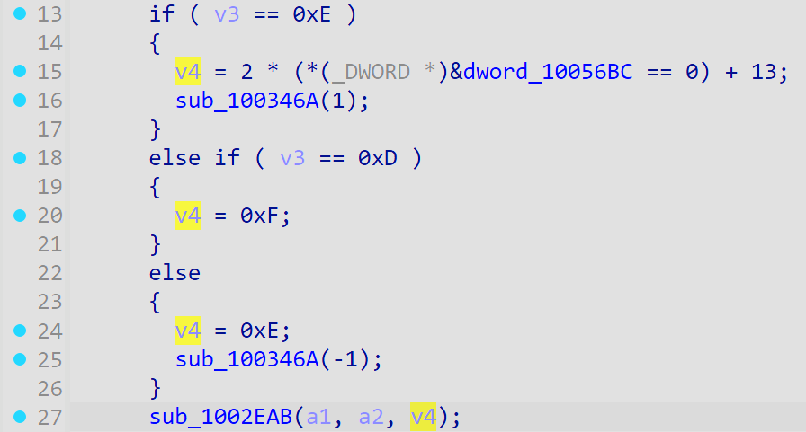
*Figure 25: the C pseudocode of the function at `0x100374F`.*

Reading the pseudocode, `v3` is the cell's current visual state and `v4` the new one:

| Current state `v3`        | New state `v4`            | Also does |
|---------------------------|---------------------------|-----------|
| `0xE` (flag)              | `0xD` or `0xF`, depending on whether the *Marks (?)* option is enabled | `sub_100346A(1)` - mine counter up |
| `0xD` (question mark)     | `0xF` (unrevealed)        | - |
| anything else (`0xF`)     | `0xE` (flag)              | `sub_100346A(-1)` - mine counter down |

This is exactly the right-click cycle the player sees: unrevealed → flag → question mark →
unrevealed, with the remaining-mines counter adjusted on each transition.

As a final verification that `sub_100374F` is the function responsible for marking a cell with
a flag or a question mark, IDA's debugger was attached to the game and breakpoints were set at
each of the three addresses: 1 (offset `0x3512`), 2 (offset `0x35B7`), 3 (offset `0x374F`). An
arbitrary cell was then right-clicked, and only one breakpoint fired - the one belonging to
`sub_100374F`. For documentation it was given the friendlier name
`onRightClickField(int row, int column)` in the IDA project file.

One practical consequence of the cycle above: calling `onRightClickField` on a cell that is
already flagged does **not** keep it flagged - it advances it to the next state. The tool must
therefore call it exactly once per unflagged mine.

---

## 5. Summary of findings

This writeup documents the static and dynamic analysis of the game's executable. The analytical
process was aimed at gathering the information needed to build a tool for Minesweeper, with the
initial goal defined as *"finding the place in memory where information about the board (the
minefield) is stored."*

Starting from that point, a thought experiment was carried out about how the minefield would be
implemented from a software-engineering perspective. It followed that the game's authors must
have used a pseudo-random number generator. Static analysis of the Import Address Table
identified references to `rand()` and `srand()` from `msvcrt.dll`. The only call to the imported
`rand()` was found inside the function at `0x1003940`; further analysis produced its full
documentation and the rename to `rand_0`. Analysing the calls to `rand_0` led to the only place
in the game's machine code where pseudo-random numbers are generated - the function at
`0x100367A` - and to the hypothesis that mine positions are drawn there.

Dynamic analysis with a debugger attached to a live instance of the game then confirmed, using
IDC breakpoint scripts, that `dword_1005334` and `dword_1005338` store the width and the height
of the board respectively - disambiguated by deliberately using a non-square custom board.

Attention then turned to reconstructing the minefield map. The variables `v1` and `v2`, bounded
by the width and the height, were confirmed to hold the column and row indices of each drawn
mine position, and were renamed to `mineColumnIdx` and `mineRowIdx`. Staying inside
`0x100367A`, the key structure of the minefield and its address were identified: the game stores
the minefield as an array of bytes at `0x1005340`, with a formula for the address of any cell of
`0x1005340 + (32 · row + column)`. Using CrySearch, all possible cell states were mapped and
described in Table 2. At this stage all information needed to implement the board-preview
feature had been acquired.

Attention was then directed at automatic flagging. To minimise the workload and avoid
interfering with the game's stability, it was decided to reuse one of the game's own functions,
called remotely by the tool. The function at offset `0x374F` was established to be the one
responsible for marking a cell after a right mouse click; it was documented and renamed
`onRightClickField(int row, int column)`.

Without the information gathered in these analyses, building the tool would have been
considerably more difficult, if not impossible.

---

## 6. From findings to code

Every finding above became a constant in
[`external/common.h`](../external/common.h). This table is the bridge between the analysis and
the implementation.

| Finding | Where it was established | Constant in `common.h` |
|---------|--------------------------|------------------------|
| XP loads the image at `0x01000000` | [§3](#3-reconstructing-the-minefield-map) | `winmine::IMAGE_BASE = 0x1000000` |
| Board width at `0x01005334` → offset `0x5334` | [§2](#2-dynamic-analysis) | `offset::BOARD_WIDTH = 0x5334` |
| Board height at `0x01005338` → offset `0x5338` | [§2](#2-dynamic-analysis) | `offset::BOARD_HEIGHT = 0x5338` |
| Minefield array at `0x01005340` → offset `0x5340` | [§3](#3-reconstructing-the-minefield-map) | `offset::MINEFIELD = 0x5340` |
| Row stride is always 32 bytes | [§3](#3-reconstructing-the-minefield-map), line 27 | `ROW_STRIDE = 0x20` |
| `address = base + 0x5340 + 32·row + col`, 1-indexed | [§3](#3-reconstructing-the-minefield-map) | `cellOffset(row, col)` |
| Bit `0x80` = mine present | [§3](#3-reconstructing-the-minefield-map), Table 1 | `cell::MINE_MASK = 0x80` |
| Bit `0x40` = revealed by the player | [§3](#3-reconstructing-the-minefield-map), Table 1 | `cell::REVEALED_MASK = 0x40` |
| Low 5 bits = visual state | [§3](#3-reconstructing-the-minefield-map), Table 2 | `cell::STATE_MASK = 0x1F` |
| Visual states `0x00`, `0x0A`–`0x10` | [§3](#3-reconstructing-the-minefield-map), Table 2 | `cell::EMPTY`, `MINE_SHOWN`, `WRONG_FLAG`, `MINE_HIT`, `QUESTION`, `FLAG`, `UNREVEALED`, `BORDER` |
| `onRightClickField(row, col)` at offset `0x374F` | [§4](#4-locating-the-flag-placement-function) | `offset::FN_ON_RIGHT_CLICK_FIELD = 0x374F` |

The board preview reads the array row by row with `ReadProcessMemory` and decodes each byte
against Table 2. The auto-flag feature allocates a page in the game process, writes a small
shellcode stub that calls `onRightClickField` with the arguments for one mine, and runs it with
`CreateRemoteThread` - once per mine. See `external/game.cpp`.

---

## Notes

- The analysis targets the Windows XP build of `winmine.exe`, a 32-bit binary Microsoft stopped
  shipping with Windows Vista. The addresses above are specific to that build.
- The binary itself is not distributed in this repository.
- Originally written as the research chapter of my bachelor's thesis and rewritten here as a
  standalone writeup. The original Polish version is available as `ref3_pl.pdf`.
